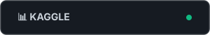
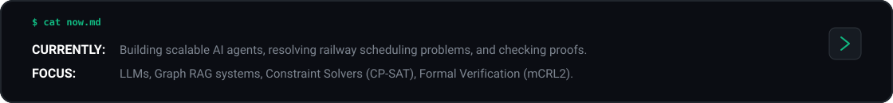
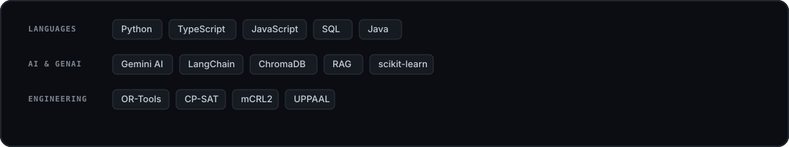

  

  &nbsp;
  &nbsp;
  

  &nbsp;
  

  

  

  

---

## About

Engineer moving into product. I pick a real problem, write the PRD, build the MVP with AI (Claude, Claude Code, Cursor), ship it, and measure it.
Final-year B.Tech (AI & Data Science). Placement Coordinator for my department. Joint Secretary of the department club.

---

## Products I've Built

### [Placement Query Platform](https://ask-placement.vercel.app/)
*   **Problem:** The placement cell answers the same student queries again and again, manually.
*   **Users:** Students and the placement department.
*   **What I built:** RAG FAQ bot plus ticket escalation for questions it can't answer.
*   **Decision:** Escalate to a human when confidence is low instead of guessing.
*   **Outcome:** [X queries handled / X% resolved without staff / X hrs saved per week]
*   *Stack:* `Python` · `RAG` · `FastAPI` · [Demo](https://ask-placement.vercel.app/)

### [AutoBI AI Analyst](https://github.com/Pranjulchaurasiya/Auto-BI)
*   **Problem:** Non-technical teams wait on analysts for simple charts and summaries.
*   **What I built:** Ask in plain English, get a Plotly dashboard and a PDF summary.
*   **Decision:** RAG over the uploaded data instead of pasting raw data into the LLM, to keep answers grounded.
*   **Outcome:** [report time from X to Y / X test users]
*   *Stack:* `Python` · `FastAPI` · `Streamlit` · `LLaMA 3.3` · `ChromaDB` · [Demo](https://bit.ly/autobi-ai-analyst)

### [PIMpulse-AI](https://github.com/Pranjulchaurasiya/PIMpulse-AI) (UniHack 2026)
*   **Problem:** Onboarding product data for industrial commerce is slow and inconsistent.
*   **What I built:** Multi-agent pipeline for verification, taxonomy alignment and copywriting.
*   **Decision:** Split into separate agents per task so each step can be checked on its own.
*   **Outcome:** [X products processed / X% fewer manual fixes]
*   *Stack:* `Python` · `Gemini AI` · `FastAPI` · `Agentic AI` · [Demo](https://pimpulse-ai.onrender.com/)

### [AI-Powered Train Traffic Decision System](https://github.com/Pranjulchaurasiya/Buildathon-Project)
*   **Winner, Gemini & Firebase Buildathon 2025**
*   **Problem:** Controllers make rescheduling calls under time pressure with many constraints.
*   **What I built:** LLM reasoning plus OR-Tools to suggest conflict-free schedules.
*   **Decision:** The solver decides, the LLM explains, so the output is verifiable.
*   *Stack:* `TypeScript` · `Gemini AI` · `OR-Tools` · `Firebase` · [Demo](https://studio.firebase.google.com/studio-9777073027)

### More engineering
*   [Safety-Assured Railway Optimization](https://github.com/Pranjulchaurasiya/safety-assured-railway-optimization): OR-Tools + mCRL2 formal verification
*   [Vigil](https://github.com/Pranjulchaurasiya/vigil): Thompson Sampling uptime monitor (FastAPI, Postgres, Valkey)

---

## How I Build With AI

*   I break the problem down first, then prompt, test, and re-prompt.
*   I review every generated diff. I never ship it blind.
*   **Example:** [One line: what the AI got wrong (bug, bad schema, hallucinated API), how you caught it, what you changed.]

---

  

  &nbsp;
  

  

